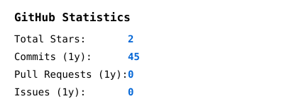

  

# 

Hi, I'm DeepaprakashRajaram. I am passionate about software engineering, system architecture, and automation. This GitHub profile is self-generating and fully automated using Python and GitHub Actions.

# 

  

# 

- **[GitHub Profile Generator](https://github.com/DeepaprakashRajaram/DeepaprakashRajaram)**: The very repository you are looking at! A deterministic, configuration-driven, self-generating profile featuring custom ASCII SVG animations.

# 

Feel free to reach out or explore my repositories above.
